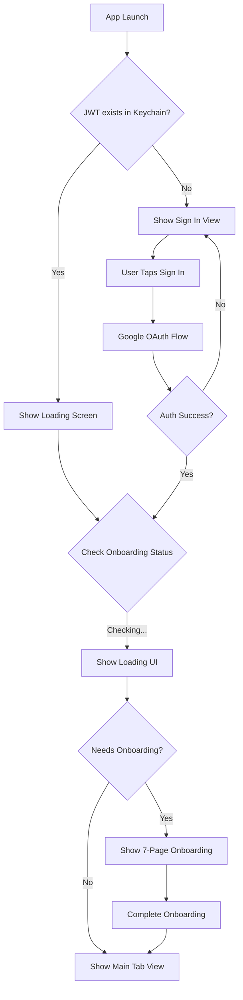
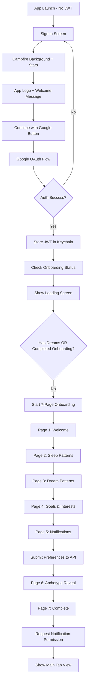
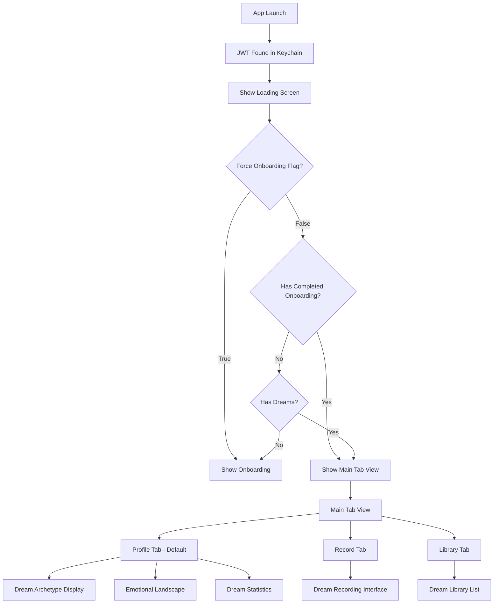
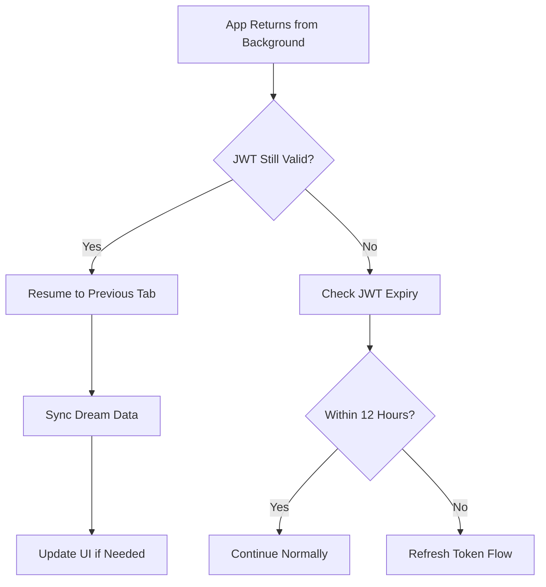
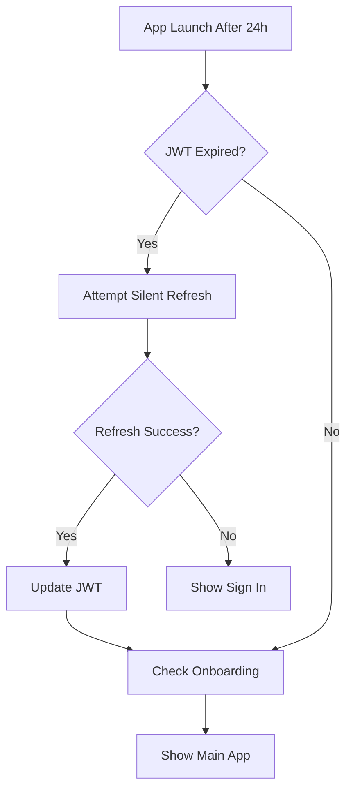
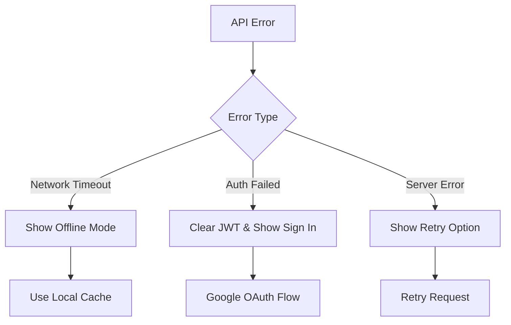

# Dream App User Flow Analysis

## Overview

This document maps out all user flows in the Dream iOS app, from initial app launch through various states and scenarios. The app uses Google OAuth for authentication and has a comprehensive onboarding flow for new users.

## Key Configuration

- **Force Onboarding Flag**: `Config.forceOnboardingForTesting = true` (currently enabled)
- **JWT Expiry**: 12 hours
- **API Base URL**: Configurable, currently set to local development server

## User Flow Diagrams

### 1. App Launch Decision Tree



### 2. New User Flow (First Time Launch)



### 3. Onboarding Flow Details

```
Page 1: Welcome
├── "Dreams hold latent magic"
├── Explains value proposition
└── Navigation: Skip | Continue →

Page 2: Sleep Patterns
├── Typical bedtime selector
├── Typical wake time selector
├── Sleep quality assessment
└── Navigation: ← Previous | Continue →

Page 3: Dream Patterns
├── Dream recall frequency
├── Dream vividness level
├── Common dream themes (multi-select)
└── Navigation: ← Previous | Continue →

Page 4: Goals & Interests
├── Primary goal selection
├── Interest areas (multi-select)
└── Navigation: ← Previous | Continue →

Page 5: Notifications
├── Enable/disable toggle
├── Reminder time selection
├── Frequency selection
├── Auto-submits preferences to API
└── Navigation: ← Previous | Submitting... →

Page 6: Archetype Reveal
├── Animated archetype symbol
├── Archetype name & description
├── Confidence percentage
└── Navigation: ← Previous | Continue →

Page 7: Complete
├── Success message
├── "Begin Dream Capture" button
├── Requests notification permission if enabled
└── Completes onboarding → Main App
```

### 4. Returning User Flow (Within JWT Validity)



### 5. Main App Navigation Structure

```
MainTabView
├── Profile Tab (Default Landing)
│   ├── Dream Archetype Avatar
│   ├── Dream Streak Visualization
│   ├── Tonight's Portal (Personalized Message)
│   ├── Recent Symbols
│   ├── Emotional Tides Chart
│   └── Dream Statistics
│
├── Record Tab
│   ├── Dream Recording Orb
│   ├── Mode Toggle (Voice/Text)
│   ├── Recording Controls
│   ├── Complete/Extend Options
│   └── Navigation to Library
│
└── Library Tab
    ├── Dream List
    ├── Search/Filter
    └── Individual Dream Details
```

### 6. Time-Based Behaviors

#### Returning After 1 Hour


#### Returning After 24 Hours


### 7. Authentication State Transitions

```
States:
1. Unauthenticated (No JWT)
   → Shows: Sign In View
   → Actions: Google OAuth

2. Authenticating
   → Shows: Loading overlay with "Signing in..."
   → Blocks: All UI interaction

3. Checking Onboarding
   → Shows: Loading screen with moon icon
   → Checks: User preferences & dream count

4. Onboarding
   → Shows: 7-page flow
   → Can skip to main app

5. Authenticated & Onboarded
   → Shows: Main Tab View
   → Default: Profile Tab
```

### 8. Error Handling Flows



## Key Implementation Details

### Visual Design Consistency
- **Background**: All screens use `DreamBackground` (gradient + stars)
- **Primary Color**: Ember orange (#FF9100)
- **Typography**: Avenir font family
- **Animations**: Fade transitions between states

### State Management
- **Authentication**: JWT stored in iOS Keychain
- **Onboarding**: UserDefaults flag + API check
- **Dream Data**: Syncing between local and remote stores

### Notification Handling
- **Permission Request**: During onboarding completion
- **Scheduling**: Based on user preferences
- **Archetype Integration**: Personalized notification content

## Edge Cases

1. **Force Onboarding Enabled**: 
   - Shows onboarding even for existing users
   - Useful for testing but should be disabled in production

2. **Network Failures**:
   - Onboarding has 10-second timeout
   - Falls back to default archetype if API fails
   - Local storage allows offline usage

3. **JWT Refresh**:
   - Automatic refresh if expiring within 5 minutes
   - Silent Google token refresh
   - Falls back to sign in if refresh fails

4. **Background Sync**:
   - Scheduled when app enters background
   - Uses iOS BackgroundTasks framework
   - Syncs dreams between local and remote

## Optimization Opportunities

1. **Reduce Onboarding Friction**:
   - Consider reducing from 7 to 4-5 pages
   - Make more fields optional
   - Progressive disclosure of features

2. **Faster Time to First Dream**:
   - Allow recording before full onboarding
   - Defer preference collection

3. **Smarter Loading States**:
   - Preload data during splash screen
   - Cache user profile locally
   - Reduce API calls on launch

4. **Personalization**:
   - Use archetype for UI customization
   - Adaptive content based on usage patterns
   - Smart notification timing based on sleep schedule